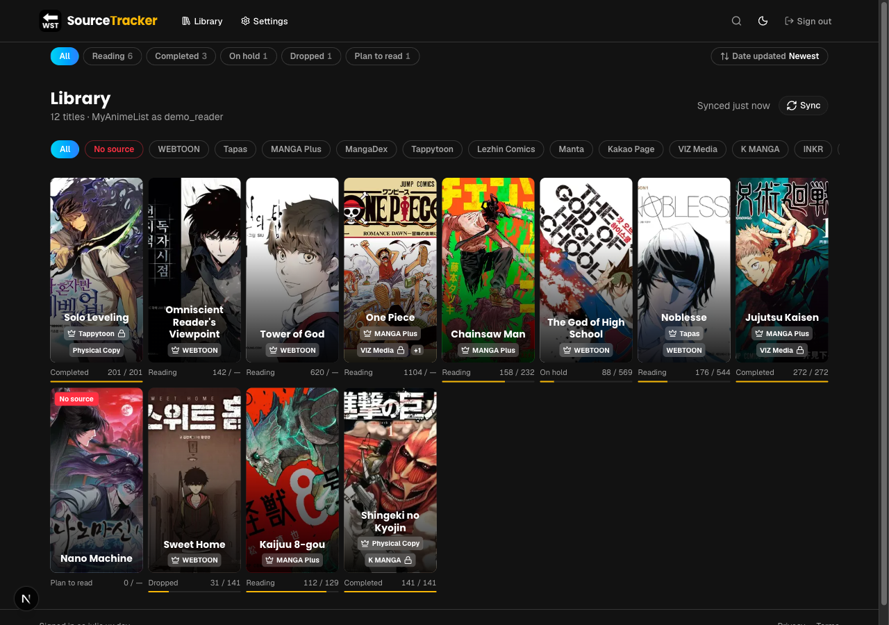
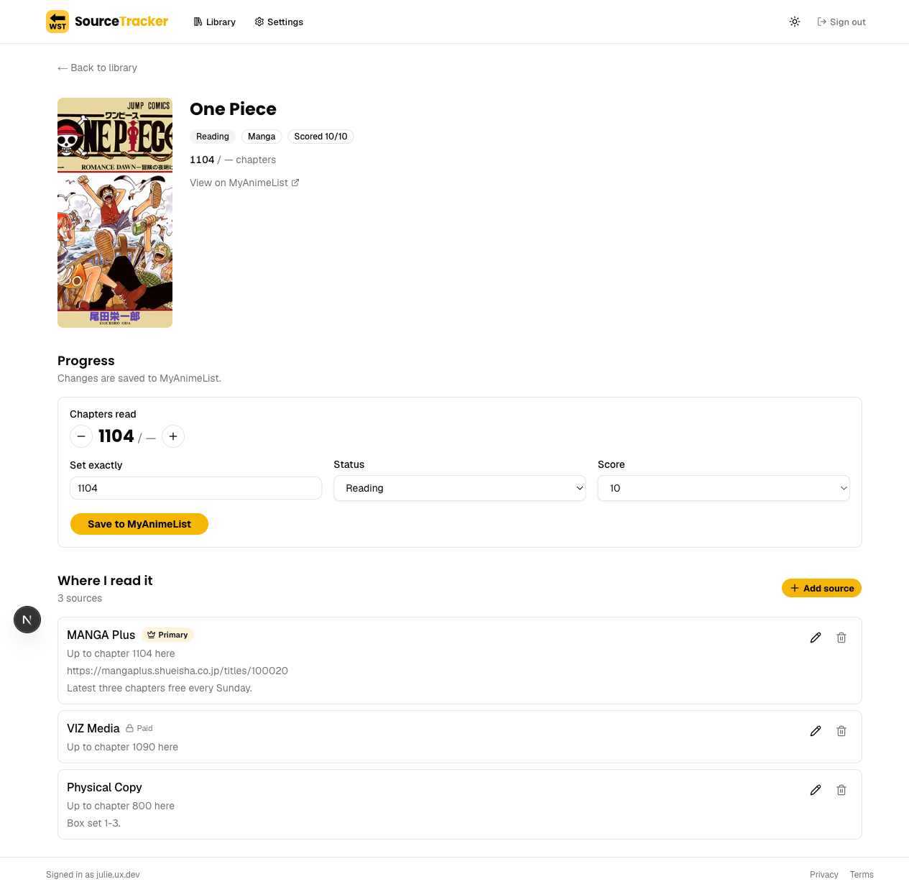
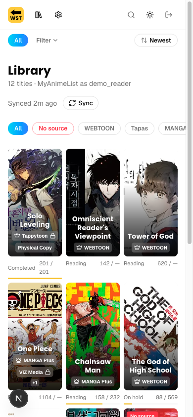

# Webtoon Source Tracker

**A reading tracker that answers the question MyAnimeList can't: *where* did I read this?**

Next.js 16 · React 19 · TypeScript · Supabase (Postgres, Auth, RLS) · Tailwind v4 · MyAnimeList API v2

**[Live app →](https://webtoon-source-tracker.vercel.app/)**



---

## The problem

MyAnimeList is the de facto database for manga readers. It knows *what* you read
and how far you got. It does not know that you read chapters 1–41 on WEBTOON,
switched to Tapas at 42 because the official English release stalled, and own
volume 1 in print.

For anyone reading webtoons that's the information that actually matters. Series
migrate between platforms, licenses lapse, official releases lag scanlations by
months. "Chapter 42" is useless without "on which app" — you can't resume
reading from a number alone.

So the product is a thin, opinionated layer: MAL stays the source of truth for
progress, and this app owns the one thing MAL will never model — the mapping
from a title to the places you actually read it.

That framing drove the central architectural decision, described below.

## The core decision: MAL as a *connection*, not a login

The obvious build is "sign in with MyAnimeList." I evaluated it and rejected it,
and the reasoning is recorded in [TODO.md](TODO.md) so it doesn't get reopened.

**Could it work?** Partly. MAL is not an OIDC provider — all four `.well-known`
discovery paths return 404 — so Supabase third-party auth is impossible. A
custom OAuth2 provider *is* technically possible; Supabase has documented
escapes for both blockers (`pkce_enabled: false`, since MAL supports only
`plain`, and `email_optional: true`, since MAL returns no email).

**Why I rejected it anyway:** it inverts the architecture. As a login provider,
Supabase would hold the MAL token, so write-back needs `provider_token`
plumbing, and MAL becomes a login *identity* instead of a *connection*.

The user-facing consequence is the part that decided it. If MAL is your login,
unlinking it locks you out of your own account, and account recovery depends on
a third party that has your email for neither password reset nor verification.
As a connection, you can unlink and relink freely without losing anything, and
recovery works like any normal account.

```
Supabase account  ←—— owns ——→  your data
       │
       └── mal_connection (active | disconnected | needs_reauth)
                    │
                    └── revocable, re-linkable, never load-bearing for login
```

The cost is a hand-rolled OAuth flow in [lib/mal/oauth.ts](lib/mal/oauth.ts)
instead of a config block. That was the right trade: the flow is ~200 lines and
written once, whereas the alternative compromises account recovery permanently.

## Working against an undocumented API

MAL's API v2 has real, load-bearing discrepancies between its documentation and
its behavior. Each of these cost debugging time, and each is now a comment
anchored at the code it constrains:

**`expires_in` is the *refresh* window, not the access token's.** MAL's prose
says access tokens last one hour. The token response returns `expires_in:
2415600` — 28 days — which is the refresh token's lifetime. Any code computing
access-token expiry from that field is wrong, and wrong in a way that only
surfaces an hour into a session. [MalClient](lib/mal/client.ts) never inspects
expiry at all; it refreshes reactively on a 401.

**The refresh token rotates on every refresh.** Persist only the access token
and the connection dies silently about a month later, long after the deploy that
caused it.

That rotation creates a concurrency bug worth calling out, because it's the kind
that survives testing and fails in production:

```ts
// Several concurrent 401s each start their own refresh; MAL rotates the
// refresh token on every call, so the later responses invalidate the earlier
// ones and the connection dies. Sharing one promise per user means N
// concurrent 401s trigger exactly one refresh.
const inFlightRefreshes = new Map<string, Promise<string>>();
```

A page that fires three server actions at once is enough to trigger it. Single-
request testing never will.

**Over-quota is signalled as 403, not 429.** Generic retry logic treats 403 as
non-retryable *or* lumps it with server errors and retries — the latter makes
the rate limiting worse. The client surfaces it as a distinct
`MalRateLimitError` instead.

**PKCE is `plain` only, and `PUT /manga/{id}/my_list_status` is form-encoded.**
Both look like bugs on first read. The `plain` challenge especially — every
instinct says to "fix" it to S256, which breaks login. It's commented in place
for exactly that reason.

## Data modelling: separating the catalog from the user

The first schema had one `media_entries` table holding both a title's identity
(*Solo Leveling*, its cover, its chapter count) and one user's relationship to
it (reading, chapter 42). Ten users tracking the same title meant ten copies of
its metadata.

The [migration that split it](supabase/migrations/20260820091241_split_catalog_from_user_entries.sql):

| Table | Holds | Owned by |
|---|---|---|
| `media_titles` | shared catalog — one row per MAL title | nobody |
| `user_entries` | one user's progress against a title | the user |
| `entry_sources` | **where that user reads it** — the product | the user |

Measured on representative data, at 500 users × 300 titles this is **~58%
smaller** (19 MB vs 45 MB). Metadata is stored once rather than once per user,
and a title's row outlives any individual user's interest in it.

The `media_type` column carries a `check (media_type in ('manga', 'anime'))` —
an expansion hook for anime that v1 never writes. One column and a constraint
now beats a table migration later.

The entry view is where the model pays off — one title, three platforms, each
with its own progress, URL, and notes:



## Protecting the irreplaceable data

`entry_sources` is the only data in the app that a re-sync cannot rebuild. Every
other row — titles, progress, scores — can be re-fetched from MAL. Source
assignments are hand-entered, and if they're lost they're gone.

That single fact drove the most defensive code in the project. Sync deletes
entries that are no longer on MAL, and that delete cascades to `entry_sources`.
A partial MAL response — one failed page, a transient 500 — would otherwise
cascade away data the user typed by hand.

So removals only run when **both** conditions hold:

```ts
const looksComplete =
  complete && (existingCount ?? 0) > 0 &&
  entryRows.length > (existingCount ?? 0) * 0.5;
```

Every page fetched cleanly, *and* the result exceeds half the stored count. A
truncated response is non-destructive by construction.

Two smaller guards sit alongside it. An empty `keepTitleIds` would render
`not in ()` — invalid SQL that would delete the user's entire library — so the
delete is gated on a non-empty list. And MAL can return the same title twice
across pages if the list is edited mid-sync, which fails a batch upsert with
`cannot affect row a second time`; rows are deduplicated through a `Map` before
they're written.

Writes follow the same principle in the other direction: **writes go to MAL
first**, and the local cache updates only from MAL's echoed response. The cache
can fall behind MAL, never ahead.

I'm explicit in [TODO.md](TODO.md) that the 50% guard makes a *truncated
response* safe but a genuine MAL-side deletion is still irreversible. The
recorded fix is an `archived_at` column. Knowing where a mitigation stops
matters more than claiming it's solved.

## Auth: two layers, deliberately

Next 16 renamed `middleware.ts` to `proxy.ts`, and most Supabase tutorials still
put `getUser()` in middleware. This app deliberately does not.

```
Browser ─▶ proxy.ts          cookie presence only — no DB, no network
             │
             ▼
        app/*  ─▶ lib/auth/dal.ts    real auth, cached per request
```

[proxy.ts](proxy.ts) checks only whether a session cookie *exists*, to avoid
flashing a protected page. It proves nothing and is not treated as if it does.
Real enforcement is `verifySession()` in [lib/auth/dal.ts](lib/auth/dal.ts),
called from the authed layout, every protected page, and **the top of every
server action** — actions are independently reachable HTTP endpoints, so a
layout check does not protect them.

Two details worth the space:

`verifySession()` uses `getClaims()`, which verifies the JWT signature locally,
rather than `getSession()`, which doesn't revalidate the token at all. And on
rejection it redirects to `/auth/clear-session` rather than `/login` — the
rejected cookie still exists in the browser, and only a Route Handler can delete
it. Redirecting straight to `/login` leaves the stale cookie in place and
`proxy.ts` keeps treating the visitor as signed in. A redirect loop that only
appears with an *expired* session, not a missing one.

MAL OAuth state is HMAC-bound to the signed-in user. Without that binding, an
attacker could complete a MAL authorization in their own browser and replay the
callback against a different logged-in account, linking their MAL to someone
else's profile. Verification is constant-time.

Tokens live in a `private` schema that PostgREST cannot reach (406 even with the
secret key), accessed through `SECURITY DEFINER` RPCs granted only to
`service_role`. RLS policies follow a documented set of conventions —
`TO authenticated` rather than the deprecated `auth.role()`, `(select
auth.uid())` in a subquery so Postgres evaluates it once per statement instead
of per row, and `with check` on every UPDATE policy, without which a user can
reassign a row's `user_id` to someone else.

## A UX bug worth the detail

Late in the build, typing in the header search interrupted itself on mobile: the
keyboard closed mid-word and the grid shifted under a half-typed query.

Two causes, both downstream of search being server-driven. The input carried
`key={urlQuery}`, so every debounced URL write remounted the focused element —
and mobile browsers dismiss the keyboard along with the node it was attached to.
The `router.replace` behind that write also re-rendered on the server, swapping
the grid out from under the caret.

The fix moved the query to client state. The page already ships the whole
library to the browser for the status and source chips, so filtering locally
costs no extra data. A keystroke sets state, the grid re-filters in the same
render, and the input is never re-created. `useDeferredValue` keeps the
re-filter at lower priority than the keystroke so a large shelf can't stutter
the field. `?q=` is still written, debounced well behind typing, so a search
stays linkable — but nothing on screen reads it back.

Two consequences fell out of the change, both worth noticing rather than
shipping past. The title count now describes the whole shelf instead of the
filtered result: a number changing under every character, inches from the field
being typed in, is the same class of distraction as the moving grid. And the
empty-state choice moved into the grid, since it keyed off the server's `q`,
which is stale mid-type.



The regression test holds the DOM node across every keystroke and asserts
identity — the old `key` shape fails it outright. Writing that test caught a
second bug in the first attempt: the URL guard read `window.location.search`,
which doesn't update until Next commits the navigation, so arriving on a shared
link re-navigated to the URL it came from.

## Testing what types can't catch

93 tests across 11 files, run in CI. The suite deliberately targets the gaps
TypeScript and ESLint leave open rather than re-verifying what they already
prove.

The clearest example is [tests/rsc-boundary.test.ts](tests/rsc-boundary.test.ts).
Passing a function from a Server Component to a Client Component throws at
runtime — but it compiles and lints cleanly, so it reaches the browser. The test
walks the source tree, resolves imports, and finds that shape statically.

The rest covers the logic where bugs are cheap to introduce and invisible to
types: sync staleness, sort and filter behavior, preference resolution where a
`null` column means "no preference" but the string `'all'` means an explicit
choice, and the search regression above.

## Engineering practice

**Comments explain *why*, and only where it's non-obvious.** Every "this looks
wrong" decision carries the reason it isn't, plus what breaks if someone
"fixes" it. The `plain` PKCE comment exists specifically to stop a future
reader from hardening it to S256 and breaking login.

**Deferred work is recorded, not forgotten.** [TODO.md](TODO.md) holds each
deferral with enough context to pick it up cold, anchored by `TODO(id)` comments
at the relevant code. Sign in with Apple documents the $99/yr account, the
client secret that expires every 6 months with a silent failure mode, and the
private-relay addresses that stop same-email auto-linking from firing. That's
enough to make the decision again rather than re-research it.

**Rejected options are recorded too.** MAL-as-login has its own section marked
*evaluated and rejected*, with the revisit condition stated: only if MAL ships
real OIDC discovery.

**Commits explain the reasoning.** The search fix's message runs several
paragraphs — symptom, both causes, why the chosen fix is cheap, what fell out of
it, and the bug that writing the test uncovered.

## What I'd do next

In priority order, from [TODO.md](TODO.md):

1. **`archived_at` on `user_entries`** — make sync removals recoverable. The
   50% guard handles truncated responses; it does not handle a genuine deletion.
2. **Confirmation before deleting a source** — currently immediate with no undo,
   on the one kind of data no sync can rebuild. `alert-dialog.tsx` is already
   installed and unused; this is its natural first use.
3. **Sign in with Apple** — small code change, real operational overhead.

## Summary

| | |
|---|---|
| **Scope** | ~9,500 lines app code, ~1,500 lines tests |
| **Schema** | 7 migrations, RLS on every user-facing table |
| **Tests** | 93 across 11 files, CI-enforced |
| **Stack** | Next.js 16 App Router · React 19 · TypeScript · Supabase · Tailwind v4 · shadcn/ui |

The work I'd point at: choosing a connection model over the easier login model
because of what it means for account recovery; splitting the catalog from user
data for a 58% storage reduction; and treating a handful of hand-entered rows as
the thing the whole sync path has to be designed around.
